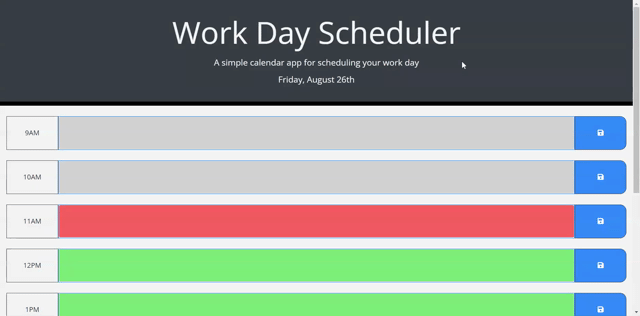

# Work Day Scheduler

## Description 
This is a daily planner. It allows users to save events to each hour of the work day; starting at 9am and ending at 5pm. The current hour will be displayed in red, past hours in grey, and upcoming hours in green. 
This site was created using HTML, CSS, JavaScript, and third parties APIs. 

## Deployed Link
https://a-riveragonzalez.github.io/work-day-scheduler/

## GitHub Repository
https://github.com/a-riveragonzalez/work-day-scheduler

## Preview
